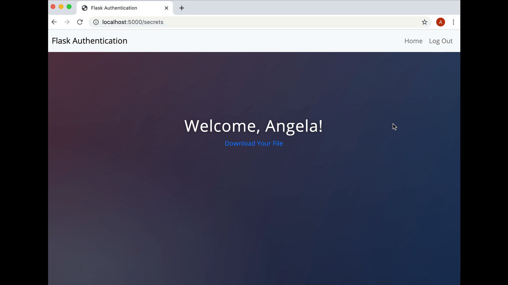

# Day 68 목표 - 인증을 통해 로그인 및 사용자 등록하기
웹 사이트의 가장 중요한 구성 요소는 사용자를 확보하는 것입니다. 웹 사이트에 기여할 수 있는 실제 사람들 말이죠. 페이스북에 사용자가 없다면 그건 단지 광고 사이트에 불과할 것이고, 사용자가 없는 블로그는 블로그 작성자의 무의미한 이야기일 뿐입니다.
그런데 사용자를 확보하고 사용자 계정에 데이터를 연결하려면 사용자를 등록하고 나중에 다시 계정에 로그인할 수 있도록 하는 방법이 필요합니다.
즉, 사용자로부터 어떤 정보를 제공받아야 하며, 그러한 정보에 대한 보안을 지켜야 함을 의미합니다. 사용자가 제공한 정보가 실제 해당 사용자의 것이 맞는지 어떻게 알아내는지가 바로 사용자 인증의 핵심이자 오늘 강의의 목표입니다. 사용자가 자신의 개인 프로필 페이지에 접속할 수 있도록 이메일과 비밀번호로 사용자 등록, 로그인, 로그아웃하는 방법을 알아봅시다.
또한 사용자가 기밀 자료인 Flask 프로그래밍 치트 시트를 다운로드할 수 있도록 하되, 우리의 웹 사이트에 등록 및 가입한 경우에만 다운로드가 가능하도록 해보겠습니다.

다음은 오늘 수업 중에 우리가 만들 항목의 데모입니다.

# 시작 프로젝트 다운로드
1. Starting Files - flask-auth-start.zip 파일을 다운로드하세요.
2. 파일의 압축을 풀고 파이참에서 여세요.
3. 필요한 패키지를 모두 설치하고(임포트) 빨간색 밑줄이 없는지 확인하세요.
시작 파일은 users.db라는 SQLite 데이터베이스로 이루어져 있으며, 이전에 데이터베이스를 만들었던 것과 같은 방식으로 만들어졌습니다.
4. DB 뷰어를 사용하여 데이터베이스를 살펴보고 데이터베이스의 필드를 숙지하시기 바랍니다.
5. 앱을 실행하고 버튼과 내비게이션 바를 사용하여 탐색합니다. 모든 HTML 페이지는 이미 올바르게 렌더링되어 있어야 합니다. 물론 로그인/등록 양식은 작동하지 않습니다. 시작하기 전에 모든 코드를 살펴보고 모든 것이 제대로 되어 있는지 확인하세요.

# 신규 사용자 등록
신규 사용자를 등록하려면 register.html에 입력한 정보를 가져와 users.db에 저장할 email, name, password를 사용하여 신규 User 객체를 만들어야 합니다.
사용자 등록이 완료되면 바로 secrets.html 페이지로 이동할 겁니다.
secrets.html 페이지에 'Hello <insert name>'이 표시되고, 여기에 등록 양식에 입력한 이름이 나타나야 합니다.
다음과 같이 표시되도록 하는 것이 우리의 목표입니다.
이 시점에서 데이터베이스에 다음과 같이 양식에 입력된 데이터와 동일한 새 항목이 표시되어야 합니다.

파일을 어떻게 다운로드할지는 아직 고민할 필요 없습니다. 다음 시간에 배울 테니까요!

https://gist.github.com/angelabauer/3d730b28bd4f27728f12db75a559da07

# 파일 다운로드하기
사용자가 secrets.html 페이지에 접속하면 기밀 파일을 다운로드할 수 있어야 합니다. 참고로 기밀 파일은 시작 프로젝트의 static > files > cheat_sheet.pdf에 있습니다.
이 문제를 해결하려면 send_from_directory()라는 플라스크의 메소드를 사용해야 합니다.
1. 먼저 secrets.html 페이지로 이동하여 앵커 태그가 /download 경로에서 서버에 GET 요청을 하도록 합니다.
2. 다운로드 경로에서 사용자가 '파일 다운로드(Download Your File)' 버튼을 클릭하면, send_from_directory()에 대한 문서를 사용하여 cheat_sheet.pdf 파일을 다운로드합니다.

https://flask.palletsprojects.com/en/1.1.x/api/#flask.send_from_directory

그러면 이렇게 되어야 합니다.

해답 - https://gist.github.com/angelabauer/fb9e657162a881d02a6b2c0024de7c15

# 암호화와 해싱

링크
https://cryptii.com/
https://www.youtube.com/watch?v=G2_Q9FoD-oQ&ab_channel=Numberphile
https://www.youtube.com/watch?v=V4V2bpZlqx8&ab_channel=Numberphile

https://plaintextoffenders.com/
https://haveibeenpwned.com/Passwords
https://en.wikipedia.org/wiki/List_of_the_most_common_passwords
http://password-checker.online-domain-tools.com/

Salt Rounds - salt+hash 의 반복 회수
비밀번호 솔팅  -- hash + salt

# Werkzeug를 사용하여 비밀번호 해싱하기
이 시점에서 사용자의 비밀번호는 데이터베이스에 일반 텍스트로 저장됩니다:
1. 데이터베이스에서 해시되지 않은 이전 항목을 삭제하세요.
비밀번호를 저장하기 전에 해시를 통해 사용자의 비밀번호를 보호합니다.
이를 위해서는 벡자이크(Werkzeug)의 헬퍼 함수 generate_password_hash()를 사용합니다.
2. 다음 링크의 문서를 사용하여 사용자 비밀번호를 해싱 및 솔트하는 방법을 알아내 보세요.
https://werkzeug.palletsprojects.com/en/1.0.x/utils/#module-werkzeug.security
pbkdf2:sha256을 사용하여 비밀번호를 해시하고
솔트 길이(salt length) 8을 추가하세요.
다음과 같은 결과나 나와야 합니다.

해답 - https://gist.github.com/angelabauer/36b4437aec707e488131189c1ec18f7f

# Flask_Login 패키지로 사용자 인증하기
현재는 /secrets으로 이동하면 기밀 페이지와 다운로드 링크가 표시되며, 인증 장벽이 없습니다. 등록/로그인한 사용자만 해당 페이지를 보고 파일을 다운로드할 수 있도록 하려면 어떻게 해야 할까요?
서버의 특정 경로를 보호하고 인증된 사용자만 접근할 수 있도록 해야 합니다.
이를 위해 대다수의 플라스크 개발자는 Flask_Login 패키지를 사용합니다.

고난이도 과제:
Flask_Login 문서를 사용하여 /login 경로를 만들어보세요. /secrets 경로는 로그인한 사용자만 접근할 수 있도록 보호되어야 합니다.

다음과 같이 만들어야 합니다.
힌트 1: Flask_Login을 사용하도록 플라스크 앱을 구성해야 합니다. 
https://flask-login.readthedocs.io/en/latest/#configuring-your-application
힌트 2: user_loader 함수를 생성해야 합니다.
https://flask-login.readthedocs.io/en/latest/#how-it-works
힌트 3: 사용자 클래스에서 UserMixin을 구현해야 합니다.
https://flask-login.readthedocs.io/en/latest/#your-user-class
참고: Mixin은 파이썬에 다중 상속을 제공하는 방법으로 Mixin을 추가하는 방법은 다음과 같습니다.
class MyClass(MixinClassB, MixinClassA, BaseClass):
Mixin에 대한 자세한 정보 https://www.thedigitalcatonline.com/blog/2020/03/27/mixin-classes-in-python/
힌트4: check_password_hash 함수를 사용하여 사용자의 비밀번호를 확인할 수 있습니다.
https://werkzeug.palletsprojects.com/en/stable/en/1.0.x/utils/#werkzeug.security.check_password_hash
힌트 5: 로그인 양식에 입력한 이메일로 사용자를 찾아야 합니다.
힌트 6: 사용자가 성공적으로 로그인 또는 등록한 경우, login_user() 함수를 사용하여 인증해야 합니다.
힌트 7: 인증된 사용자만 액세스할 수 있도록 /secrets과 /download 경로를 모두 보호해야 합니다.
https://flask-login.readthedocs.io/en/latest/#flask_login.login_required

해답 - https://gist.github.com/angelabauer/f53574e00338a08e989c3c983506a8ba

# 플라스크 플래시 메시지
사용자가 수행한 작업에 대한 피드백을 제공하고자 하는 경우가 생길 수 있습니다. 예를 들어 '로그인에 문제가 있었나요?', '잘못된 비밀번호를 입력했거나 이메일이 존재하지 않습니까?'와 같은 피드백을 전달하고 싶은 상황에서 로그인 페이지로 계속 리디렉션하는 대신 무엇이 잘못되었는지 알려준다면 좋은 사용자 경험을 제공할 수 있을 것입니다.
이를 위한 가장 쉬운 방법은 플라스크 플래시(Flask Flash) 메시지를 사용하는 것입니다. 이는 템플릿으로 전송되어 한 번만 표시되는 메시지로, 페이지를 새로고침하면 사라집니다.
https://flask.palletsprojects.com/en/1.1.x/patterns/flashing/

1. 아래 예시와 같이 사용자의 이메일이 데이터베이스에 없는 경우, 사용자에게 플래시 메시지를 보내 이를 알리고 로그인 경로로 다시 리디렉션하도록 로그인 경로를 업데이트하세요.
힌트: 로그인 페이지의 
 태그는 빨간색 텍스트로 표시됩니다.
2. 아래 예시와 같이 check_password 함수가 False를 반환하면 사용자를 다시 로그인 페이지로 리디렉션할 때 플래시 메시지를 보내도록 로그인 경로를 업데이트하세요.
3. 아래 예시와 같이 사용자가 입력한 이메일이 데이터베이스에 이미 존재할 경우 로그인 페이지로 리디렉션하고 이미 등록된 사용자임을 알리는 플래시 메시지가 표시되도록 /register 경로를 업데이트하세요.

해답 - https://gist.github.com/angelabauer/b58cf1f98a9460eaf9a9adfd8d8b28e3

# 인증상태를 템플릿에 전달하기
사용자가 로그인할 때 홈페이지에 로그인/등록 버튼이 보이면 안 됩니다. 내비게이션 바에도 등록 또는 로그인이 보이면 안 됩니다.
이렇게 되도록 base.html과 index.html에서 코드를 바꿀 수 있는지 시도해 보세요.
이전 수업에서 base.html이 모든 페이지가 만들어지는 레이아웃 템플릿이라고 배웠던 것을 기억하세요.
https://flask.palletsprojects.com/en/1.1.x/patterns/templateinheritance/

해답 - https://gist.github.com/TheMuellenator/8f99d3f77114064f5aee8e8be0669fbd
