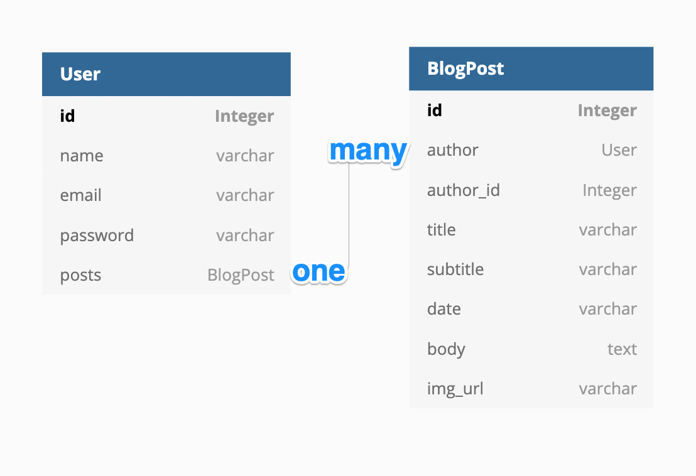
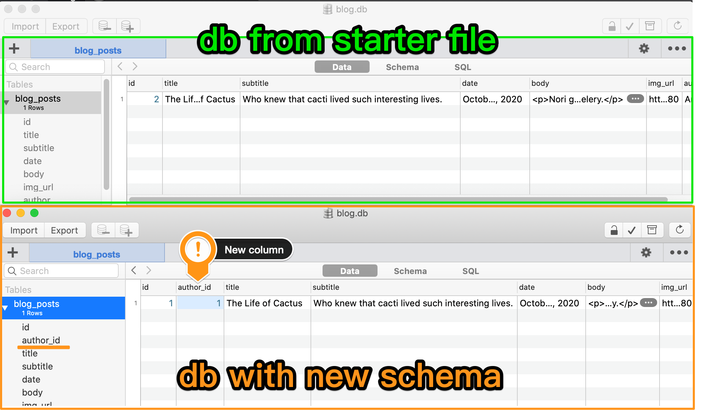
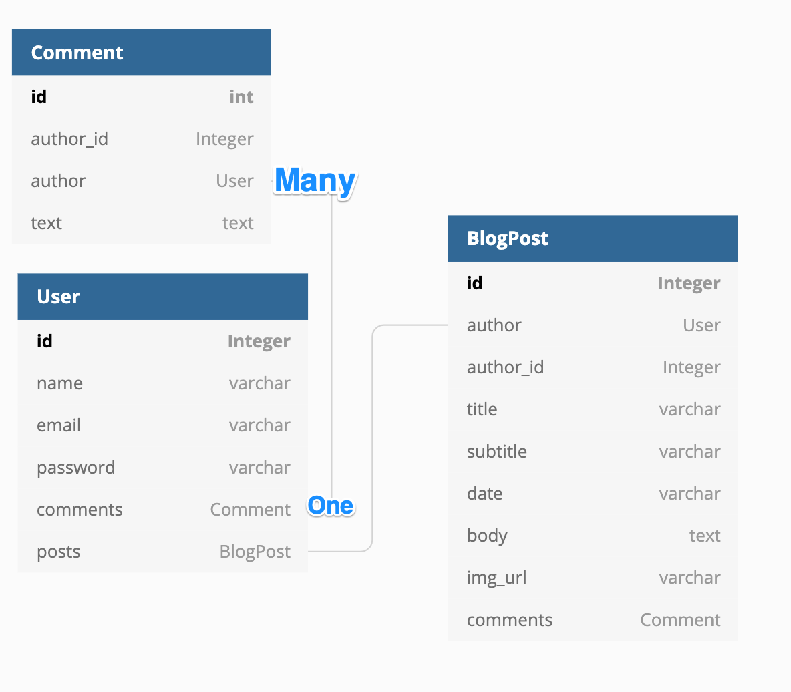
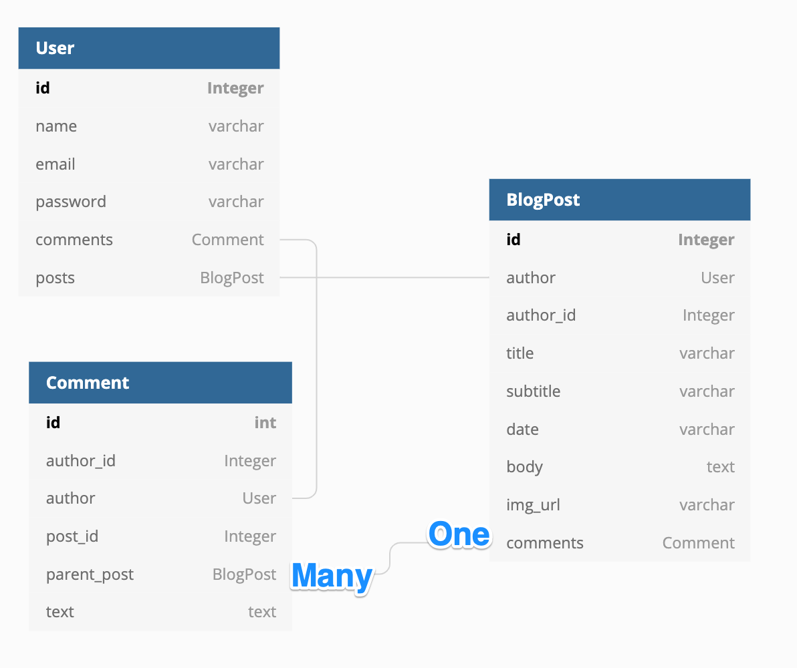

# 69일차 목표 - 블로그 프로젝트에 사용자 추가하기
우리 블로그에 사용자들이 생기면 멋지지 않을까요? 누군가 가입해 블로그 게시물에 댓글을 달 수 있다면 어떨까요? 그렇게 하려면 블로그에 인증을 추가해야 합니다. 이것은 블로그 프로젝트에서 화룡점정과도 같은 마지막 단계입니다. 이것까지 마치면 우리 블로그는 모두 완성되어 사용 가능한 상태가 될 겁니다.

# 시작 프로젝트 다운로드하기
1. Starting Files - blog-with-users-start.zip 파일을 다운로드하세요.
2. 파일의 압축을 풀고 파이참에서 여세요.
3. 필요한 패키지를 모두 설치하고(임포트) 빨간색 밑줄이 없는지 확인하세요.
시작 파일은 blog.db라는 SQLite 데이터베이스로 이루어져 있으며, 이전에 데이터베이스를 만들었던 것과 같은 방식으로 만들어졌습니다.
4. DB 뷰어를 사용하여 데이터베이스를 살펴보고 데이터베이스의 필드를 숙지하시기 바랍니다.
5. 앱을 실행하고 버튼과 내비게이션 바를 사용하여 탐색합니다. 모든 HTML 페이지는 이미 올바르게 렌더링되어 있어야 합니다. 물론 로그인/등록 양식은 작동하지 않습니다. 시작하기 전에 모든 코드를 살펴보고 모든 것이 제대로 되어 있는지 확인하세요.


# 요구 사항 1 - 신규 사용자 등록
1. 어제 배운 내용을 활용하여 사용자가 /register 경로로 이동해서 블로그 웹 사이트에 등록할 수 있도록 합니다. forms.py에 RegisterForm이라는 WTForm을 만들고 플라스크 부트스트랩을 사용하여 wtf quick_form을 렌더링해야 합니다.
사용자가 입력한 데이터를 사용하여 User 테이블의 blog.db에 새 항목이 만들어져야 합니다.

다음과 같이 되어야 합니다.
힌트 1: register.html에서는 아무것도 변경할 필요 없습니다.
힌트 2: 지금은 데이터베이스에 신규 사용자를 생성하는 중이고, 로그인은 다음 단계에서 배울 예정이니 Flask-Login에 대해서는 아직 걱정하지 마세요.

해답 - https://gist.github.com/angelabauer/03e62a9322fd07199dc2ca9195783286


# 요구 사항 2 - 등록된 사용자 로그인
. 성공적으로 등록이 완료된(데이터베이스의 사용자 테이블에 추가된) 사용자는 login 경로로 이동하여 자신의 크리덴셜(자격 증명 정보)을 사용하여 로그인할 수 있어야 합니다. 그러려면 Flask-Login 문서와 어제 배운 내용을 활용해야 합니다.

해답 - https://gist.github.com/angelabauer/f50dc46ccd8de8cd22c1f580d6adcc85

2. /register 경로에 코드 한 줄을 추가해서 사용자 등록이 성공적으로 완료된 경우 해당 사용자를 다시 홈페이지로 보내 Flask-Login으로 로그인하도록 만들어보세요.

해답 - https://gist.github.com/angelabauer/0aadbac11fb8e18d7ec511195a5b913d

3. /register 경로에서 사용자가 데이터베이스에 이미 존재하는 이메일로 등록을 시도하는 경우, /login 경로로 리디렉션하고 해당 이메일로 로그인하라는 플래시 메시지가 표시되어야 합니다.

해답 - https://gist.github.com/angelabauer/590c77a17b7eefeed694b1bae487c30d

4. /login 경로에서 사용자의 이메일이 데이터베이스에 존재하지 않거나 비밀번호가 check_password()를 사용하여 저장된 것과 일치하지 않을 경우, 다시 /login으로 리디렉션하고, 사용자에게 어떤 문제가 발생했는지 알리고 다시 시도하도록 요청하는 플래시 메시지가 표시되도록 해야 합니다.

해답 - https://gist.github.com/angelabauer/d273a5fcca075020528c22bebf7d83ec

5. 어떻게 내비게이션 바를 업데이트하면 사용자가 로그인하지 않은 경우 다음과 같이 표시되도록 할 수 있는지 알아내 보세요.
단, 사용자가 등록 후 로그인/인증된 경우에는 내비게이션 바에 다음과 같이 표시되어야 합니다.
힌트: 내비게이션 바 코드는 header.html 안에 있습니다.
힌트: https://flask-login.readthedocs.io/en/latest/#login-example

해답 - https://gist.github.com/angelabauer/fb21f437deeeb4d38d1b07534d31a5cc

6. 사용자가 로그아웃 버튼을 클릭하면 로그아웃하고 홈페이지로 다시 이동하도록 /logout 경로를 코딩하세요.

해답 - https://gist.github.com/angelabauer/6611007cfc82bfacc527680b51061032


# 요구 사항 3 - ​​경로 보호
우리가 만든 블로그에서는 최초로 등록된 사용자가 관리자가 됩니다. 관리자는 새 블로그 게시물을 생성할 수 있고, 게시물 수정 및 삭제도 할 수 있습니다.
1. 최초 사용자의  id 는 1입니다. 여기서 index.html 파일과 post.html 파일을 수정해서 관리자에게만 “새 게시물 생성”과 게시물 “수정” 및 “삭제” 버튼이 보이게 할 수 있습니다.

솔루션 - https://gist.github.com/angelabauer/223c5e4e1a2ecd0f232f18ab3471733a

2. 사용자에게 해당 버튼이 보이진 않지만, 수동으로 /edit-post, /new-post 및 /delete 라우트에 액세스할 수 있습니다.  @admin_only라는 Python 데코레이터를 생성해서 해당 라우트를 보호하십시오.
액세스를 시도하는 현재 사용자의 id가 1이라면 해당 라우트에 액세스할 수 있지만, id가 1이 아니라면 403 오류(권한 없음)를 받습니다.
힌트 1: 54일 차의 Python 데코레이터 강의를 복습해 보세요.
힌트 2: @login_required 데코레이터를 확인해 보세요. https://flask.palletsprojects.com/en/1.1.x/patterns/viewdecorators/#login-required-decorator
힌트 3: abort 함수로 403 혹은 404와 같은 HTTP 오류를 간단히 반환할 수 있습니다. https://flask.palletsprojects.com/en/1.1.x/patterns/errorpages/

솔루션 - https://gist.github.com/angelabauer/36083610dcdcbe704b3c30b51e2fe414


# 관계형 데이터베이스 만들기
최초의 사용자가 관리자이며 블로그 소유자가 됩니다. 사용자가 생성한 게시물을 해당 사용자와 데이터베이스에서 연결되도록 합니다. 추후 다른 사용자가 블로그에 게시물을 생성할 수 있도록 초대하고 관리자 권한을 주어야 할 수도 있습니다.
따라서  User 테이블과  BlogPost 테이블 간의 관계를 생성하고 연결해야 합니다. 관계로 연결해야 사용자가 생성한 블로그 게시물을 볼 수 있습니다. 혹은 특정 블로그 게시물의 작성자가 어느 사용자인지 확인할 수 있죠.
단순히 Python 코드만 작성한다면, BlogPost 객체 목록이 들어있는 posts 라는 프로퍼티를 가진  User 객체를 생성한다고 생각하면 됩니다.
예를 들면,
```
class User:
    def __init__(self, name, email, password):
         self.name = name
         self.email = email
         self.password = password
         self.posts = []
 
class BlogPost:
    def __init__(self, title, subtitle, body):
         self.title = title
         self.subtitle = subtitle
         self.body = body
 
new_user = User(
    name="Angela",
    email="angela@email.com",
    password=123456,
    posts=[
        BlogPost(
            title="Life of Cactus",
            subtitle="So Interesting",
            body="blah blah"
        )
    ]        
}
```

이를 통해 특정 사용자가 작성한 모든 게시물을 쉽게 찾을 수 있습니다. 그 반대의 경우는 어떻게 할까요? 특정 게시물 객체를 작성한 사용자는 어떻게 찾을까요? 이를 위해, 단순한 Python 데이터 구조가 아닌, 데이터베이스를 사용하는 것입니다.
SQLite, MySQL 혹은 Postgresql 등의 관계형 데이터베이스에서는 ForeignKey 메서드와 relationship() 메서드를 사용해서 테이블 간 관계를 정의할 수 있습니다.
예를 들어 사용자가 여러 개의 게시물 객체를 생성할 수 있는 상황에서, 사용자 테이블과 게시물 테이블 간에 일대다 관계를 생성하려면 SQLAlchemy 공식 문서를 참고하세요.

https://docs.sqlalchemy.org/en/13/orm/basic_relationships.html

과제 1: 부모에 해당하는 사용자와 자식에 해당하는 게시물 클래스 코드를 수정하여 두 테이블 간에 양방향 일대다 관계를 생성해 보세요. 사용자가 생성한 게시물과 게시물 객체의 사용자를 쉽게 찾을 수 있을 것입니다.

힌트:


솔루션 - https://gist.github.com/angelabauer/c51045b37432fd321e8f2f66b3e7d490


# 스키마 수정 후 데이터베이스 재생성
이 상황에 블로그를 재실행한다면 오류가 발생할 것입니다.
OperationalError: (sqlite3.OperationalError) no such column: blog_posts.author_id
main.py 파일의 새 코드가 시작 코드의 원본 데이터베이스 파일인 blog.db  에는 존재하지 않았던 새로운 열을 추가함으로써 데이터베이스를 수정하기 때문입니다.
author_id = db.Column(db.Integer, db.ForeignKey("users.id"))
이렇게 되면 보존할 가치가 있는 데이터가 사라지며, 기존 blog.db 파일을 완전히 삭제하고 db.create_all() 라인을 사용해 테이블을 처음부터 재생성하는 것이 가장 쉽습니다. 단, 이 방법은 데이터베이스를 완전히 정리하는 것이므로 사용자를 다시 등록하고 게시물도 다시 생성해야 합니다.

블로그 웹사이트를 새로 고치면, index.html 페이지와 page.html 페이지에서 작성자 이름이 사라질 것입니다.


# 과제 2: index.html 페이지와 post.html 페이지를 수정하여 적절한 위치에 작성자 이름이 출력해 보세요.
힌트: BlogPost 의 author 프로퍼티는 User 객체가 됩니다.

솔루션 - https://gist.github.com/angelabauer/0461fdb724b36d224cf32c78e398b0fe


# 요구 사항 4 - 모든 사용자가 블로그 게시물에 댓글을 추가할 수 있도록 하기
1. form.py 파일에 CommentForm을 생성하면 사용자가 댓글을 작성할 수 있는 CKEditorField가 단 하나만 생길 것입니다.
힌트: 공식 문서 혹은 67일 차 강의에서 CKEditor를 구현하는 방법을 확인하세요.

솔루션 - https://gist.github.com/angelabauer/0fd2d9d5aaa89c7497ec7c74f2afecea

다음 단계는 사용자가 댓글을 작성하고 저장할 수 있도록 하는 것입니다. 데이터베이스 내 테이블 간에 관계를 어떻게 설정하는지 배웠습니다. 어느 사용자든 게시물에 댓글을 작성할 수 있는 새로운 테이블을 생성해 관계를 업그레이드해 봅시다.

2. tablename이  "comments"인  Comment(댓글) 테이블을 만드세요. id와 text프로퍼티를 넣어서 CKEditor에 기본 키와 텍스트가 들어가도록 하십시오.

솔루션 - https://gist.github.com/angelabauer/a6047516bdbec2ed14e0bffee87276fc

3. 부모에 해당하는 User 테이블과 자식에 해당하는 Comment 테이블 간에 일대다 관계를 설정하십시오. 한 User가 다수의 Comment 객체에 연결될 것입니다.
힌트:


솔루션 - https://gist.github.com/angelabauer/907bfbed5671b8d5535f2c4f8befd3f1

4. 부모에 해당하는 각 BlogPost객체와 자식에 해당하는 Comment객체 간에 일대다 관계를 설정하십시오. 각 BlogPost에 관련된 Comment객체가 여러 개 있을 수 있습니다.

힌트:


솔루션 - https://gist.github.com/angelabauer/786cdab9a2a78537ae74fcb2ff8f02cc

5. 이렇게 새 테이블을 추가하면, 기존의 blog.db 파일을 완전히 삭제하고 db.create_all() 라인을 이용해 모든 테이블을 새로 생성하는 것이 좋습니다.
단, 새로운 관리자(id == 1)와 새 게시물 그리고 댓글을 작성할 다른 사용자를 생성해야 합니다.
예를 들면, 관리자부터 등록하고:
게시물을 읽을 사용자를 등록한 후:
게시물을 생성합니다:

6. 사용자 ‘아무개’로(혹은 관리자가 아닌 다른 사용자로서) 로그인해 게시물에 댓글을 작성해 보세요. 이를 위해서는 /post/<int:post_id> 라우트를 업데이트해야 합니다. 인증된(로그인된) 사용자만 댓글을 저장할 수 있도록 주의하십시오. 로그인하지 않았다면, 로그인하라는 메시지를 띄우고 /login로 리디렉션하십시오.

솔루션 - https://gist.github.com/angelabauer/96ca40c2b196b5c6020ae7ad4805cc74

7. post.html 파일의 코드를 업데이트해 게시물에 관련된 모든 댓글을 출력하십시오.
힌트 1: 댓글 작성자 이미지는 추후에 작업할거예요.
힌트 2: comments 프로퍼티는 각 게시물에 있으니 목록으로 취급하면 됩니다.
힌트 3: CKEditor로 생성된 각 댓글의 텍스트는 각 게시물의 본문과 같으니 HTML 형식으로 저장해야 합니다.

솔루션 - https://gist.github.com/angelabauer/3c17f838b4055f74b3fe2ce0422a9156

Gravatar 이미지는 인터넷상 어디에서든 댓글 작성자 이미지로서 쓰입니다.
예를 들면, 아래 게시물의 댓글에서 보실 수 있습니다:
블로그 웹사이트 곳곳에서 사용하는 Gravatar 이미지를 다음 웹사이트에서 바꿀 수 있습니다. http://en.gravatar.com/
Flask 애플리케이션에 Gravatar 이미지를 구현하는 건 아주 간단합니다.

7. 여기서 Gravatar 공식 문서를 보고 댓글 섹션에 Gravatar 이미지를 추가하십시오.
다음 그림과 같이 되어야 합니다:
힌트: http://en.gravatar.com/site/implement/images

솔루션 - https://gist.github.com/TheMuellenator/3268172ea5e2d0f90f6bca96d30f3a72


